# 💻 HackHub

HackHub es una plataforma administrativa para una escuela de programación. Esta aplicación fue desarrollada como parte del proyecto final del curso de Angular en CoderHouse. La plataforma permite gestionar estudiantes y cursos, así como sus inscripciones ofreciendo funcionalidades avanzadas como CRUD completo, roles y permisos, y protección de rutas.

## 📝 Descripción

HackHub es una aplicación web desarrollada con Angular para el frontend y JSON Server para simular el backend. La plataforma está diseñada para permitir a los administradores gestionar la información de los estudiantes y los cursos, incluyendo la creación, edición y eliminación de registros.

## ✅ Funcionalidades

- **Gestión de Estudiantes, Cursos e Inscripciones:** CRUD completo para entidades de estudiantes y cursos.
- **Relaciones Many-to-Many:** Relación entre estudiantes y cursos.
- **Roles y Permisos:** Diferentes funciones disponibles según el rol del usuario.
- **Protección de Rutas:** Implementación de guards para proteger las rutas.
- **Alertas:** Uso de SweetAlert para mostrar alertas interactivas.
- **Material Design:** Integración con Angular Material para un diseño moderno y responsivo.
- **Estado Global:** Uso de Redux para manejar el estado del login de usuario.

## 💡 Tecnologías Utilizadas

- **Frontend:** Angular, Angular Material, Redux, SweetAlert
- **Backend:** JSON Server (para simular las peticiones HTTP)
- **Lenguajes:** TypeScript
- **Herramientas de Desarrollo:** Git, GitHub

## 🔨 Instalación

1. Clona el repositorio:
    ```bash
    git clone https://github.com/GwynethS/HackHub.git
    ```
2. Navega al directorio del proyecto:
    ```bash
    cd hackhub
    ```
3. Instala las dependencias:
    ```bash
    npm install
    ```
4. Ejecuta el servidor JSON:
    ```bash
    json-server --watch db.json
    ```
5. Inicia la aplicación Angular:
    ```bash
    ng serve
    ```
6. Abre tu navegador y ve a `http://localhost:4200`.

## 👩🏻‍💻 Uso

1. Inicia sesión con las credenciales proporcionadas.
```
Admin:
  - Email: gwyneth@gmail.com
  - Password: 12345678
User:
  - Email: alexandra@gmail.com
  - Password: 12345678
```
2. Navega a las diferentes secciones de la plataforma para gestionar estudiantes y cursos.
3. Usa las funcionalidades CRUD para agregar, editar o eliminar registros.

## 📸 Ejecución
Formulario de *login*

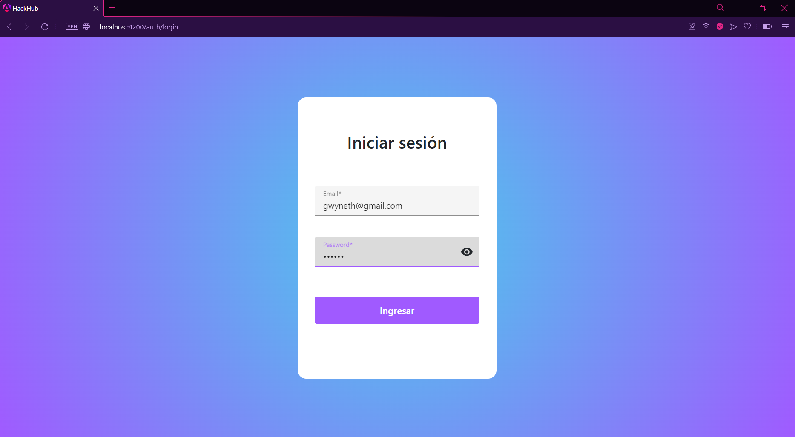

Página de Inicio (*vista de administrador*)

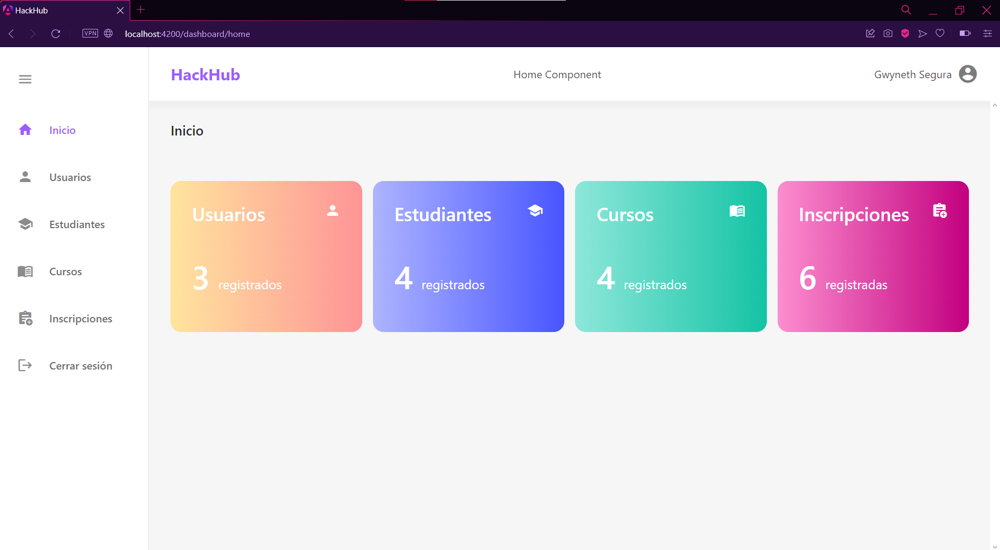

Página de Inicio (*vista de usuario*)

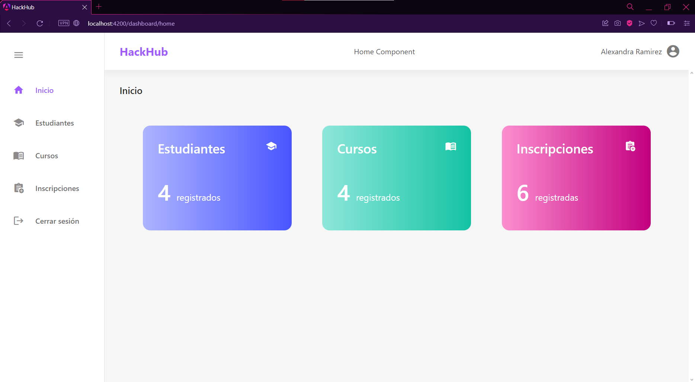

Página de Usuarios (*vista de administrador*)

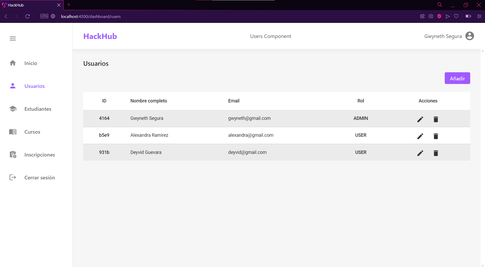

Formulario de Usuarios (*vista de administrador*)

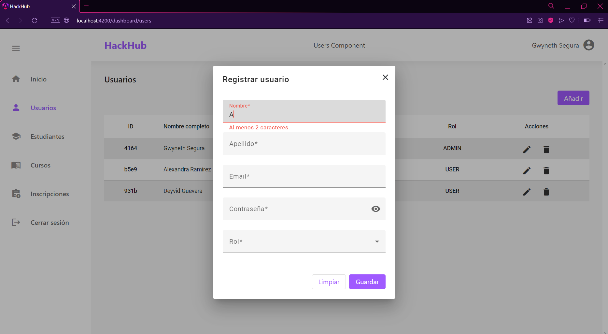

Eliminar Usuario (*vista de administrador*)

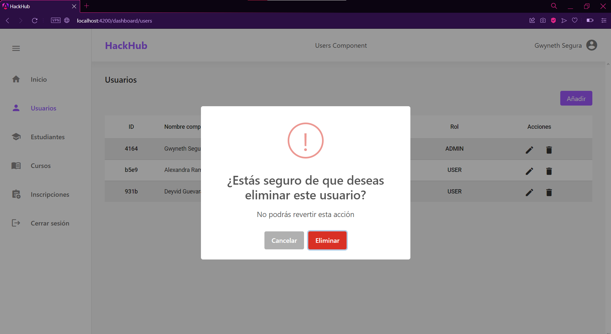

Página de Estudiantes (*vista de administrador*)

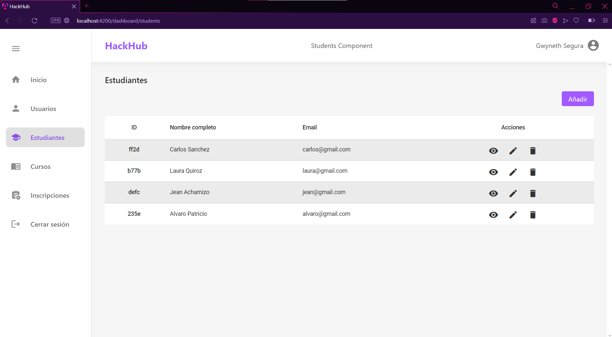

Formulario de Estudiantes (*vista de administrador*)

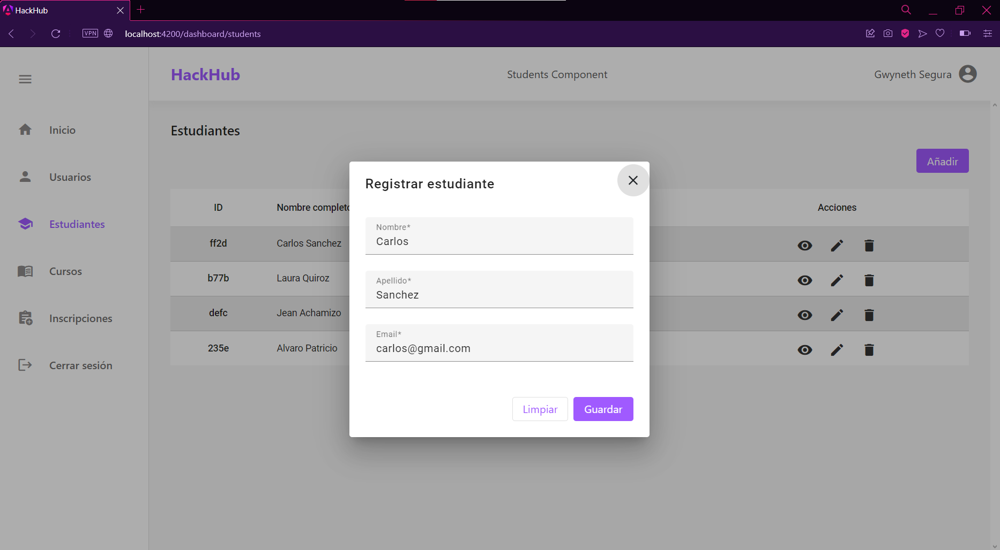

Página de Estudiantes (*vista de usuario*)

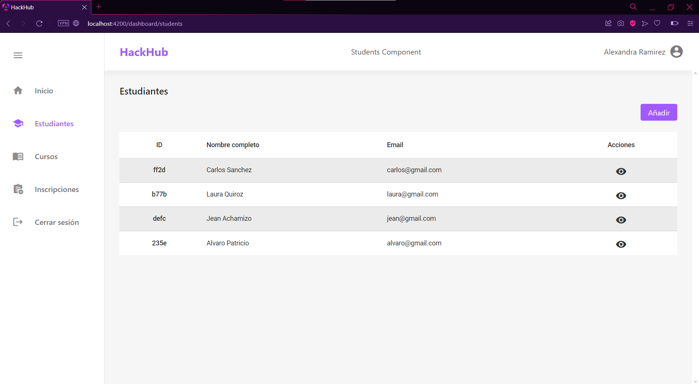

Página de Información de un Estudiante

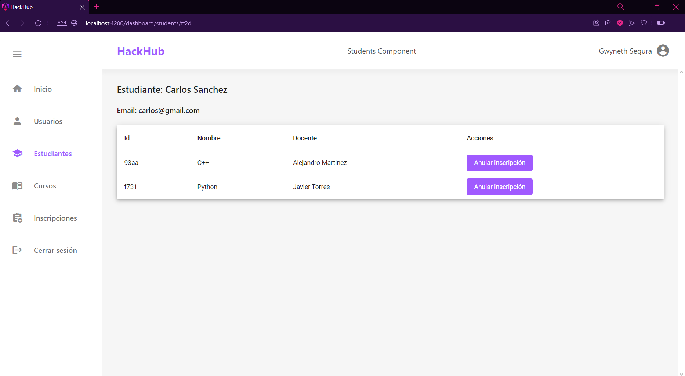

Página de Cursos (*vista de administrador*)

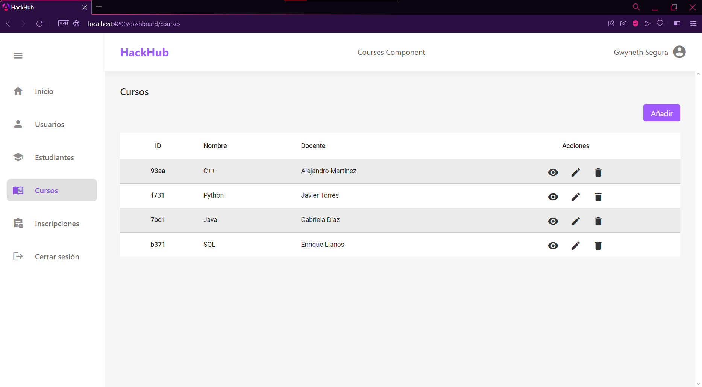

Formulario de Cursos (*vista de administrador*)

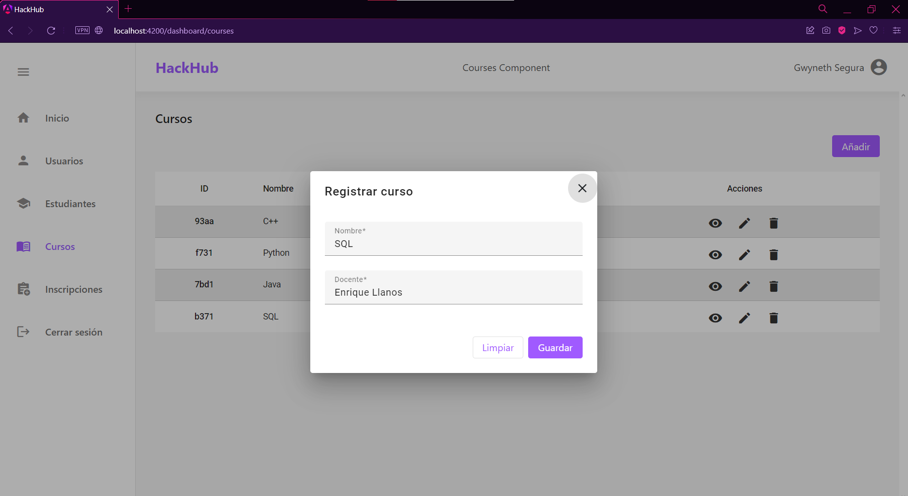

Página de Cursos (*vista de usuario*)

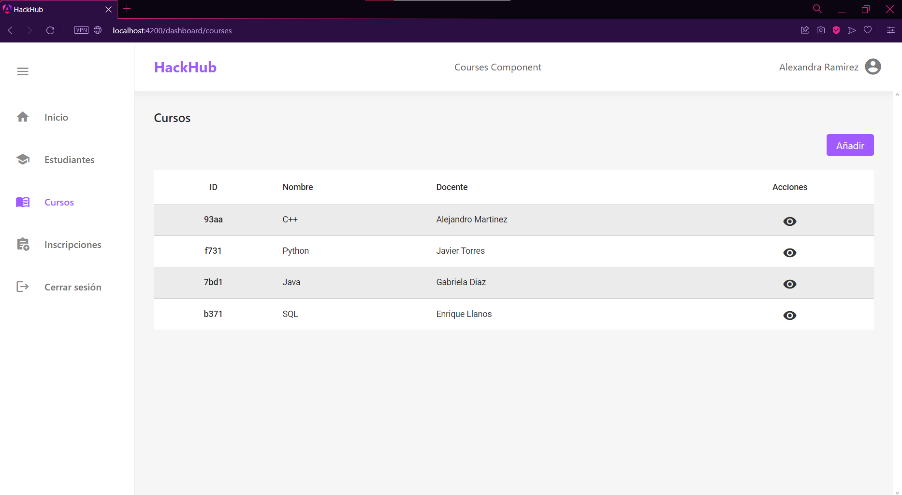

Página de Información de un Curso

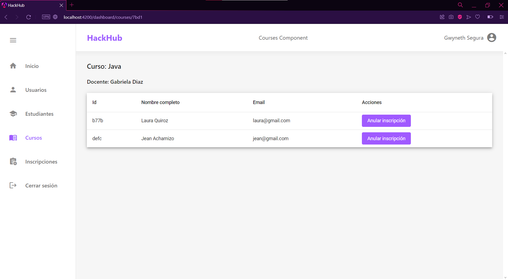

Página de Inscripciones

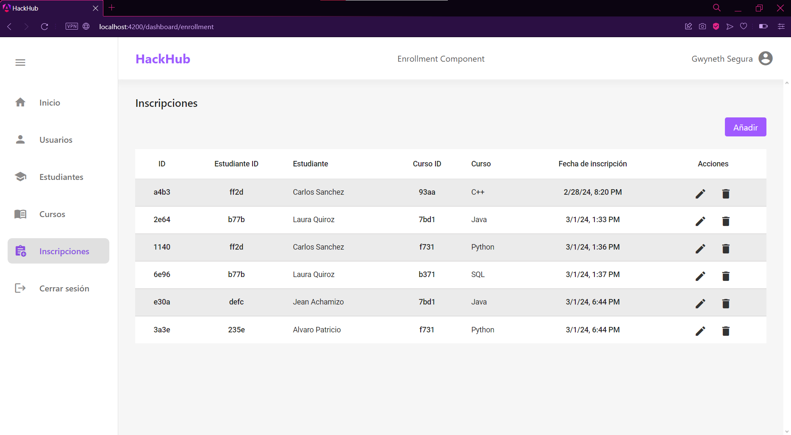

Formulario de Inscripciones

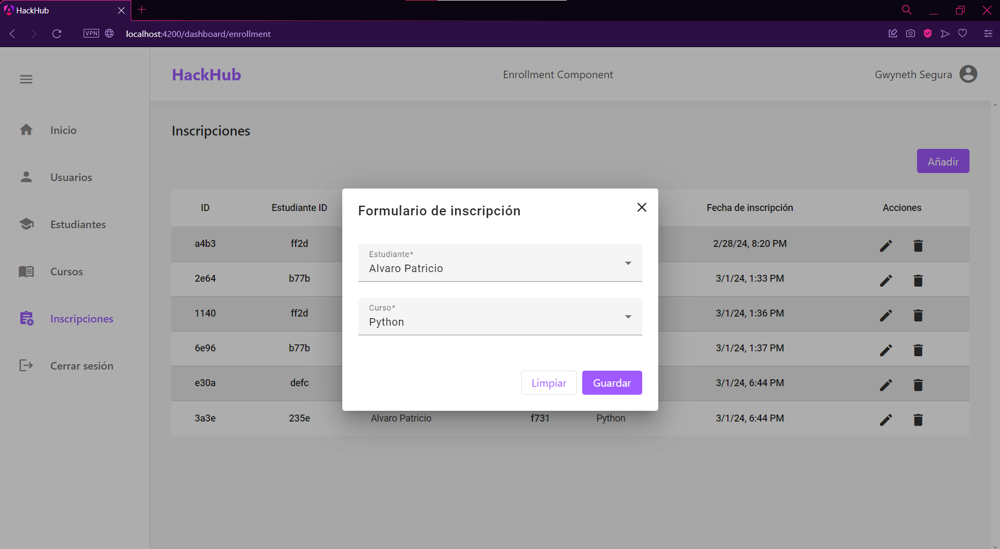

Página 404

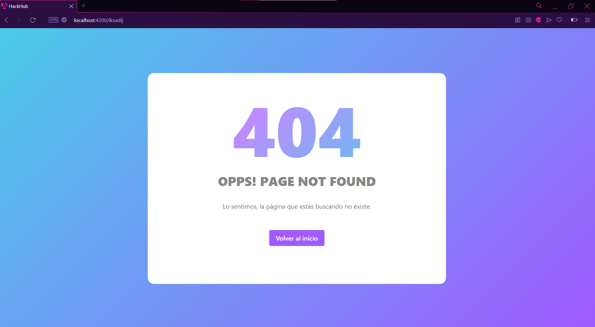


